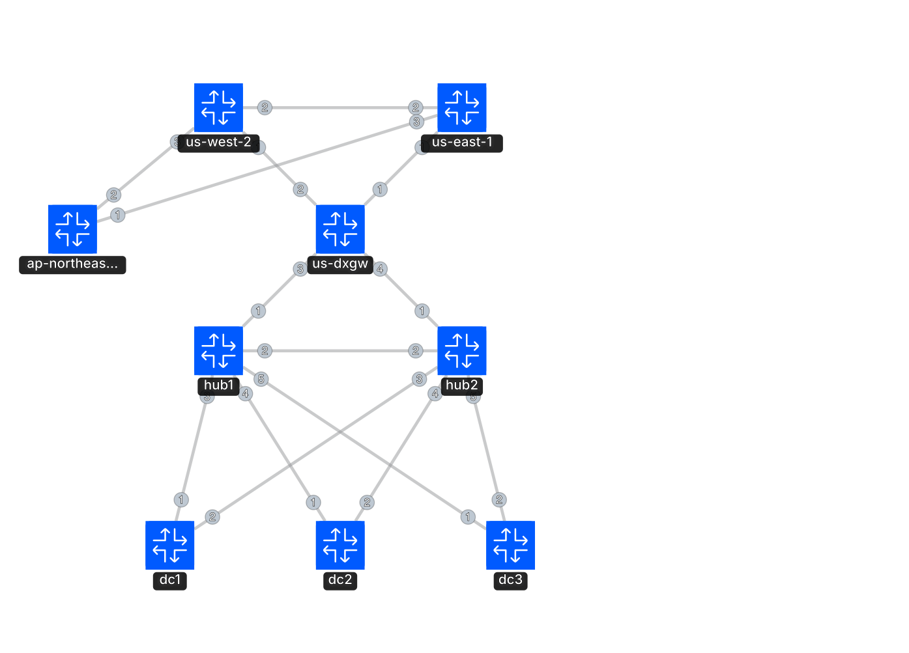

# Routing Lab

## Overview

This is a [containerlab](https://containerlab.dev/) lab environment for learning basic routing concepts. It is primarily centered around BGP and topologies supporting hybrid cloud connectivity.

## Design

**Peering Subnet:** 10.10.10.0/24 (/31 point-to-point links)

## Topology

### Networks Advertised

| Prefix | Origin Node | Description |
| ------ | ----------- | ----------- |
| 10.70.0.0/16 | dc1 | On-premises data center 1 |
| 10.80.0.0/16 | dc2 | On-premises data center 2 |
| 10.90.0.0/16 | dc3 | On-premises data center 3 |
| 10.100.0.0/16 | us-east-1 | AWS US East 1 region |
| 10.120.0.0/16 | us-west-2 | AWS US West 2 region |
| 10.140.0.0/16 | ap-northeast-1 | AWS Asia Pacific (Tokyo) region |

### Autonomous Systems

| ASN | Node | Description |
| ---- | ---- | ----------- |
| 65051 | hub2 | On-premises hub router 2 |
| 65052 | hub1 | On-premises hub router 1 |
| 65061 | dc1 | On-premises data center 1 |
| 65062 | dc2 | On-premises data center 2 |
| 65063 | dc3 | On-premises data center 3 |
| 65100 | us-dxgw | AWS Direct Connect Gateway |
| 65101 | us-east-1 | AWS US East 1 (TGW/CWAN CNE) |
| 65102 | us-west-2 | AWS US West 2 (TGW/CWAN CNE) |
| 65103 | ap-northeast-1 | AWS Asia Pacific Tokyo (TGW/CWAN CNE) |

### Interface Addressing (/31 point-to-point)

| Link | Node A | IP | Node B | IP |
| ---- | ------ | --- | ------ | --- |
| DXGW ↔ us-east-1 | us-dxgw:eth1 | 10.10.10.0 | us-east-1:eth1 | 10.10.10.1 |
| DXGW ↔ us-west-2 | us-dxgw:eth2 | 10.10.10.2 | us-west-2:eth1 | 10.10.10.3 |
| DXGW ↔ hub1 | us-dxgw:eth3 | 10.10.10.4 | hub1:eth1 | 10.10.10.5 |
| DXGW ↔ hub2 | us-dxgw:eth4 | 10.10.10.6 | hub2:eth1 | 10.10.10.7 |
| us-east-1 ↔ us-west-2 | us-east-1:eth2 | 10.10.10.23 | us-west-2:eth2 | 10.10.10.22 |
| us-east-1 ↔ ap-northeast-1 | us-east-1:eth3 | 10.10.10.51 | ap-northeast-1:eth1 | 10.10.10.50 |
| us-west-2 ↔ ap-northeast-1 | us-west-2:eth3 | 10.10.10.53 | ap-northeast-1:eth2 | 10.10.10.52 |
| hub1 ↔ hub2 | hub1:eth2 | 10.10.10.20 | hub2:eth2 | 10.10.10.21 |
| hub1 ↔ dc1 | hub1:eth3 | 10.10.10.31 | dc1:eth1 | 10.10.10.30 |
| hub1 ↔ dc2 | hub1:eth4 | 10.10.10.35 | dc2:eth1 | 10.10.10.34 |
| hub1 ↔ dc3 | hub1:eth5 | 10.10.10.39 | dc3:eth1 | 10.10.10.38 |
| hub2 ↔ dc1 | hub2:eth3 | 10.10.10.33 | dc1:eth2 | 10.10.10.32 |
| hub2 ↔ dc2 | hub2:eth4 | 10.10.10.37 | dc2:eth2 | 10.10.10.36 |
| hub2 ↔ dc3 | hub2:eth5 | 10.10.10.41 | dc3:eth2 | 10.10.10.40 |

## Roadmap and Objectives

1. Segment production and non-production traffic
    - Maybe VRFs
    - Maybe just advertise multiple prefixes for simplicity :)
1. Configure ECMP for hub links
1. Traffic steering with BGP attributes
   - Local preference
   - AS path prepending
   - MED
   - BGP communities
